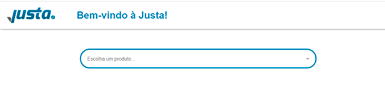

## Teste Rápido para vaga de Front-End da Justa Pagamentos


### :computer: O Deploy da aplicação
[Deploy](https://desafio-justa.herokuapp.com/)

### :file_folder: O Projeto
Criar uma página com uma listagem de itens e ao selecionar um item, um card deverá ser exibido com os detalhes deste item. O card de detalhes deverá ter os seguintes itens:
- magem para representar o item escolhido;
- Título do Item;
- Subtítulo do item;
- Botão para fechar o card e limpar o item escolhido no input.

### :telescope: Tecnologias

- Node.js
- react.js
- commerce.js

### :information_source: Como usar
Para clonar e rodar esta aplicação você vai precisar [Git](https://git-scm.com)
 [Node.js v15.2.1][nodejs] ou superir + [npm v6.14.8][npm] ou superior instalado no seu computador.

No prompt digite os seguintes comandos:

```bash
# Clone este repositório
$ git clone https://github.com/abraaovilanova/jst-job-challenges
# Acesse a pasta do projeto
$ cd jst-job-challenges
# Instale as dependencias para rodar o servidor
$ npm install
# Instale a biblioteca
$ npm install commerce.js
# rodar o servidor
$ npm start
```

### :gift: Contributing

Pull requests are welcome. For major changes, please open an issue first to discuss what you would like to change.
Please make sure to update tests as appropriate.


Feito por Abraão Vila nova
