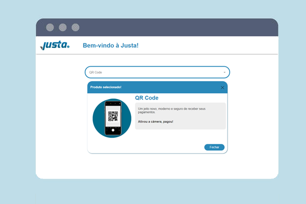

## Teste Rápido para vaga de Front-End da Justa Pagamentos


### :computer: O Deploy da aplicação
O deploy da aplicação foi feito no 
[Deploy](https://desafio-justa.herokuapp.com/)

### :file_folder: Objetivo do Projeto
Criar uma página com uma listagem de itens e ao selecionar um item, um card deverá ser exibido com os detalhes deste item. O card de detalhes deverá ter os seguintes itens:
- magem para representar o item escolhido;
- Título do Item;
- Subtítulo do item;
- Botão para fechar o card e limpar o item escolhido no input.

### :telescope: Tecnologias utilizadas

- [Git](https://git-scm.com/)
- [Node.js](https://nodejs.org/en/)
- [npm](https://www.npmjs.com/)
- [react.js](https://pt-br.reactjs.org/)
- [commerce.js](https://commercejs.com/)

### :information_source: Como usar
Para clonar e rodar esta aplicação você vai precisar [Git](https://git-scm.com)
 [Node.js v15.2.1][nodejs] ou superir + [npm v6.14.8][npm] ou superior instalado no seu computador.

No prompt digite os seguintes comandos:

```bash
# Clone este repositório
$ git clone https://github.com/abraaovilanova/jst-job-challenges
# Acesse a pasta do projeto
$ cd jst-job-challenges
# Instale as dependencias para rodar o servidor
$ npm install
# Instale a biblioteca
$ npm install @chec/commerce.js
# rodar o servidor
$ npm start
```
### :mag: Testes
- Foi usado um teste para orientar o que esperava-se dos blocos de códigos a serem programados;

- Para verificar se qualquer alteração realizada atende aos requisitos solicitados, acesse o terminal e execute o seguinte comando:

```bash
$ npm test
```

Feito com :gift_heart: por Abraão Vila nova
